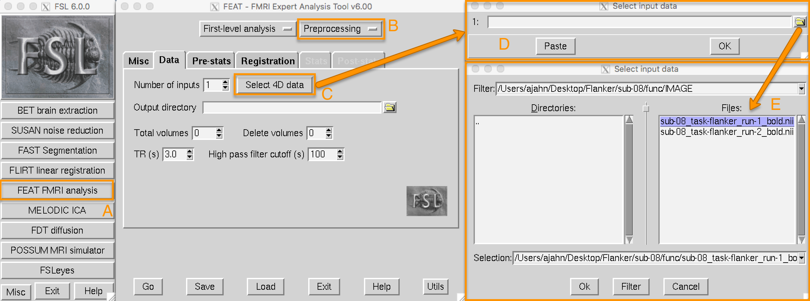

.. _FEAT_GUI.rst

第2章: FEAT GUI 和加载功能数据
^^^^^^^^^^^

剩余的预处理步骤（从运动校正到归一化）将在 FEAT GUI 中完成。FEAT 按钮位于 FSL GUI 菜单的中间，点击它会打开一个包含多个选项卡的窗口。

  点击 FEAT fMRI 分析按钮 (A) 会打开 FEAT GUI。目前我们将重点关注 ``Data``、``Pre-stats`` 和 ``Registration`` 选项卡，这些选项卡用于预处理数据。从右上角的下拉菜单 (B) 中选择 ``Preprocessing``。这将使 Stats 和 Post-stats 选项卡变灰，并允许我们仅专注于预处理。点击 ``Select 4D data`` 按钮 (C) 加载您的成像数据（在本例中为 ``sub-08_task-flanker_run-1_bold.nii.gz``，位于 ``func`` 目录中）。这将打开一个新窗口 (D)，其中有一个文件夹图标，允许您选择一个功能成像运行 (E)。

当您加载一个功能图像时，FSL 会从该图像的 **头文件** 中读取信息。可以将图像本身视为一个三维数字矩阵，较高的数字表示为比较低数字更亮。这种对比度使我们能够区分图像中的不同结构。而头文件包含您在图像中看不到但显示图像所需的信息——例如方向。四维数据的头文件（即包含多个体积的单个数据集）还包含指示 :ref:`TR <Repetition_Time>` 和体积数量的数字。

加载输入数据后，这些字段将自动填充到 FEAT GUI 的相应字段中，如以下视频所示：

.. figure:: FEAT_GUI_Demonstration.gif

  请确保检查 TR 和体积数量是否与您在扫描仪上获取的数据匹配。如果您对所使用的参数有任何疑问，请咨询您的扫描技术员。

接下来的两个选项卡，Pre-stats 和 Registration，将在后续章节中讨论。要继续学习预处理步骤的教程，请点击“下一步”按钮。
