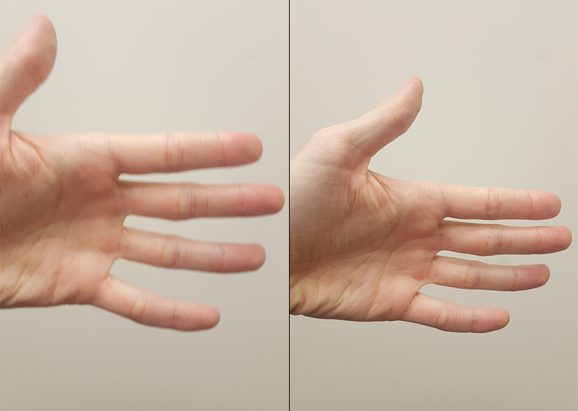
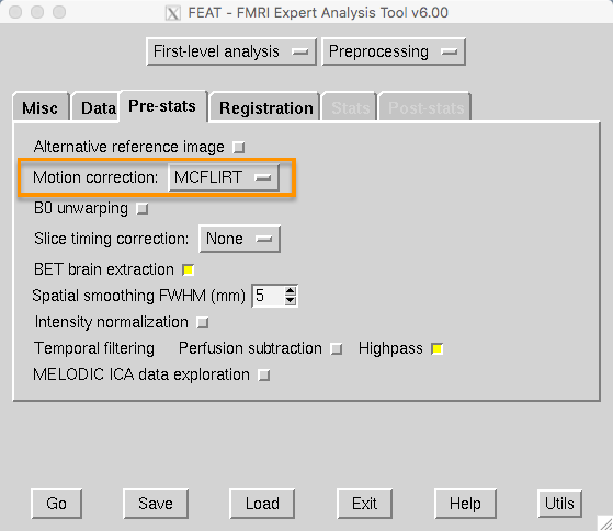

.. _Motion_Correction:

第3章: 运动校正
^^^^^^^^^^

如果您曾尝试拍摄移动物体的照片，通常图像会变得模糊。如果物体静止不动，相比之下，您会得到一张更清晰且定义明确的图像。

  移动的目标会导致模糊的图像（左图），而静止的目标会生成更清晰的图像（右图）。
  
当我们拍摄大脑的三维图像时，概念是相同的。如果受试者在移动，图像看起来会模糊；如果受试者保持静止，图像会更加清晰。但这还不是全部：如果受试者移动过多，我们还可能面临从一个体素测量信号的风险。这样，我们可能在实验的一部分时间内测量到来自某个体素的信号，而在受试者移动后，测量到的是来自不同区域或组织类型的信号。

.. 此处可以包含一个动画来说明上述段落

最后，运动可能会在成像数据中引入混杂因素，因为运动会产生信号。如果受试者每次对刺激作出反应时都会移动——例如，每次感受到电击时都会猛地摇头——那么我们可能无法确定我们测量到的信号是对刺激的反应，还是由于运动引起的。

一种“校正”这些运动的方法是通过 **刚体变换** 。为了说明这一点，拿起一个附近的物体：例如手机或咖啡杯。将它放在您面前，并在脑海中标记它的位置。这是 **参考点** 。然后将物体向左移动一英寸。这被称为 **平移** ，意味着任何向左或向右、向前或向后、向上或向下的移动。如果您想让物体回到它的起始位置，只需将它向右移动一英寸。

类似地，如果您将物体向左或向右旋转，您可以通过向相反方向旋转相同的角度来撤销这种旋转。这些被称为 **旋转** ，与平移一样，它们有三个 **自由度** ，即它们可以移动的方式：围绕x轴（也称为 **俯仰** ，即前后倾斜）、围绕y轴（也称为 **滚动** ，即左右倾斜）和围绕z轴（或 **偏航** ，如摇头表示“否”）。

.. note::

  通过移动自己的头部来尝试这些平移和旋转。首先，在保持直视前方的同时，将头部从一侧移动到另一侧（沿x轴平移）。然后，将头部向前和向后移动（y轴），以及向上和向下移动（z轴）。也尝试这些旋转。

我们对三维图像执行相同的程序。与上述示例中的参考点不同，我们将时间序列中的第一个图像称为 **参考图像** 。如果在扫描过程中某个时间点受试者将头部向右移动了一英寸，我们可以检测到这种运动，并通过将该三维图像向左移动一英寸来撤销它。目标是检测任何体积中的运动，并将这些图像 **重新对齐** 到参考图像。

.. figure:: MotionCorrectionExample.gif

  参考体积可以是时间序列中的任何体积（尽管通常是第一个、中间或最后一个体积）。如果在扫描过程中受试者向右移动，则可以通过向左进行等量且相反的移动来相对于参考体积“撤销”该运动。
  
在 FEAT GUI 中，运动校正在 ``Pre-stats`` 选项卡中指定。FEAT 的默认设置是使用 FSL 的 MCFLIRT 工具，您可以在下拉菜单中看到它。您可以选择关闭运动校正，但除非有特殊原因，否则请保持默认设置。

.. :scale: 60 %

``Pre-stats`` 选项卡还包含其他预处理选项，例如切片时间校正和平滑处理。有关切片时间校正的概述，请点击“下一步”按钮。
