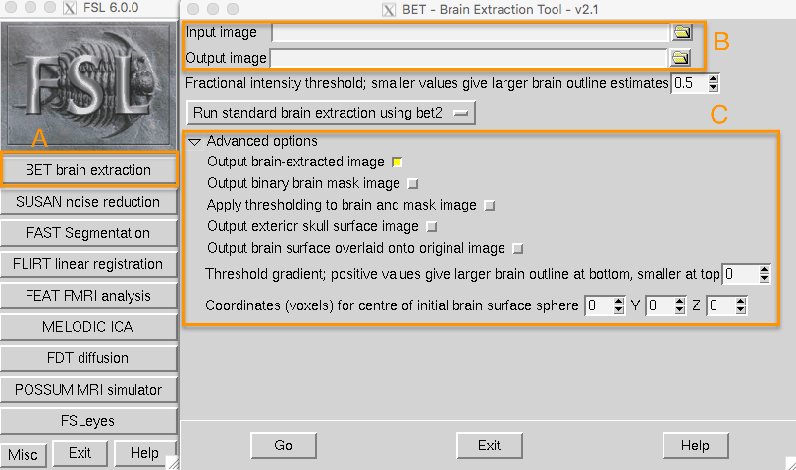

.. _Skull_Stripping:

第1章: 脑提取（“去颅骨”）
==============================

--------------------

由于fMRI研究主要关注脑组织，我们的第一步是从图像中移除颅骨和非脑区域。FSL有一个工具叫做 **bet** ，即脑提取工具（Brain Extraction Tool）。它是FSL GUI中列出的第一个按钮（如下图中的“A”所示）。点击此按钮后，会打开一个新窗口，允许您指定要进行去颅骨处理的输入图像以及去颅骨后的输出图像的名称（B），并提供一个可展开的子窗口，允许您指定高级选项（C）。

.. note::
  对于BET和许多其他FSL工具，您需要指定一个输入图像和一个输出图像的标签：某些操作会在输入图像上执行（例如去颅骨），而输出图像是该操作的结果。通常，其他选项会设置为适用于大多数数据集的默认值，但如果需要，您可以覆盖它们。
  

从 ``sub-08`` 目录打开FSL GUI，点击 ``Input image`` 字段旁边的文件夹图标，导航到 ``anat`` 目录。选择文件 ``sub-08_T1w.nii.gz`` 并点击确定按钮。注意， ``Output image`` 字段会自动填充为在输入图像名称后附加 “brain” 一词，这是FSL的默认设置。您可以更改名称，但在本教程中我们将保持默认设置。

现在点击窗口底部的 ``Go`` 按钮。您会看到一些文本写入到终端，显示运行名为 ``bet2`` 的命令所使用的命令。花点时间看看GUI如何对应于终端——稍后我们将利用这一点，通过GUI创建一个模板，然后在终端中修改它以自动预处理数据集中所有受试者的数据。

查看数据
********

当终端显示“Finished”时， ``bet2`` 已完成。由于您创建了一个新图像，您应该 **查看您的数据** ，我们将在每个预处理步骤后执行此操作。

.. note::
  新手经常听到“查看您的数据”这句话被反复强调。重要的是 *如何* 查看数据，本章中的每个预处理步骤之后都会附有关于需要查看什么的建议，以及具体的示例说明什么是可以接受的，什么是问题——以及如何解决它们。尽管我们无法涵盖所有可能的示例，但随着经验的积累，您将能够判断哪些图像质量良好，哪些需要修复或移除。
  

点击GUI底部的 ``FSLeyes`` 按钮。当它打开时，点击 ``File -> Add from File`` ，按住Shift键选择原始解剖图像和刚刚创建的去颅骨图像。如您在 :ref:`上一章 <fMRI_03_LookingAtTheData>` 中所见，您需要更改对比度以清晰地区分灰质和白质。

通过加载两个图像，您可以比较去颅骨前后的图像。在FSLeyes左下角的 ``Overlay List`` 面板中，点击“眼睛”图标以隐藏相应的图像。例如，如果您点击 ``sub-08_T1w`` 旁边的眼睛图标，原始T1解剖图像将变得不可见，您将只看到去颅骨后的大脑。如果再次点击眼睛图标，您将看到原始T1。为了更明显地显示大脑之间的差异，在 ``Overlay List`` 面板中突出显示去颅骨图像，然后将对比度从 ``Greyscale`` 更改为 ``Blue-Light blue`` 。下面的动画展示了如何执行此操作。

.. warning::

  自2019年11月发布的fsleyes版本以来，一些用户在尝试加载由任何FSL命令生成的图像时会遇到以下错误消息：“Error loading overlay: Does not look like a BIDS file.” 如果您收到此错误消息，请尝试将anat和func目录中的.json文件移动到一个单独的文件夹中，然后再次尝试加载图像。

点击图像并用鼠标观察是否有过多的大脑或过少的颅骨被移除。请记住，我们的目标是创建一个仅保留大脑（例如皮层、皮层下结构、脑干和小脑）的图像，颅骨和面部已被完全移除。

.. figure:: BET_Demonstration.gif

  使用BET检查去颅骨前后解剖图像的演示。请注意，在额叶皮层部分，大脑的一部分已被移除。确保检查所有三个视图窗格以查看问题所在。

修复不良的去颅骨
***********

如果您对去颅骨的结果不满意，可以怎么做？回想一下，BET窗口包含一些可以更改的选项。其中一个字段标记为 ``Fractional intensity threshold`` ，默认设置为0.5。旁边的文本解释说，较小的值会生成较大的大脑轮廓估计（反之亦然，较大的值会生成较小的大脑轮廓估计）。换句话说，如果我们认为去除了太多的大脑，应将其设置为较小的值；如果我们认为去除了太少的颅骨，则应设置为较大的值。

由于BET似乎去除了太多的大脑，请尝试将分数强度阈值降低到0.2。同时确保更改输出名称，以帮助您记住所做的更改——例如 ``sub-08_T1w_brain_f02`` 。点击 ``Go`` 按钮重新运行去颅骨。

.. figure:: BET_f02_GUI.png

完成后，在FSLeyes中加载最新的去颅骨图像。点击原始解剖图像旁边的眼睛图标，同时点击我们刚刚创建的最新去颅骨图像旁边的眼睛图标。注意更多的皮层被保留下来，特别是在额叶皮层和顶叶皮层。您可能还会注意到在此图像中保留了更多的硬膜和颅骨碎片。一般来说，保留过多颅骨的风险要小于去除过多皮层的风险——因为在以后的预处理步骤中（例如标准化），颅骨的碎片不会导致失败，但一旦去除了皮层，就无法恢复。

--------------

练习
***********

1. 将分数强度阈值更改为0.1并重新运行BET，确保选择适当的输出名称以保持文件的组织。在FSLeyes中查看结果。使用0.9的分数强度阈值重复这些步骤。你注意到了什么？什么似乎是一个好的阈值？

2. 在FSLeyes中尝试不同的对比度颜色作为叠加图像，看看你最喜欢哪一种。使用缩放滑块（放大镜图标旁边）集中查看您认为去颅骨效果不佳的区域。通过点击蒙太奇上方工具栏中的相机图标拍摄蒙太奇的照片（即所有三个视图窗格）。

