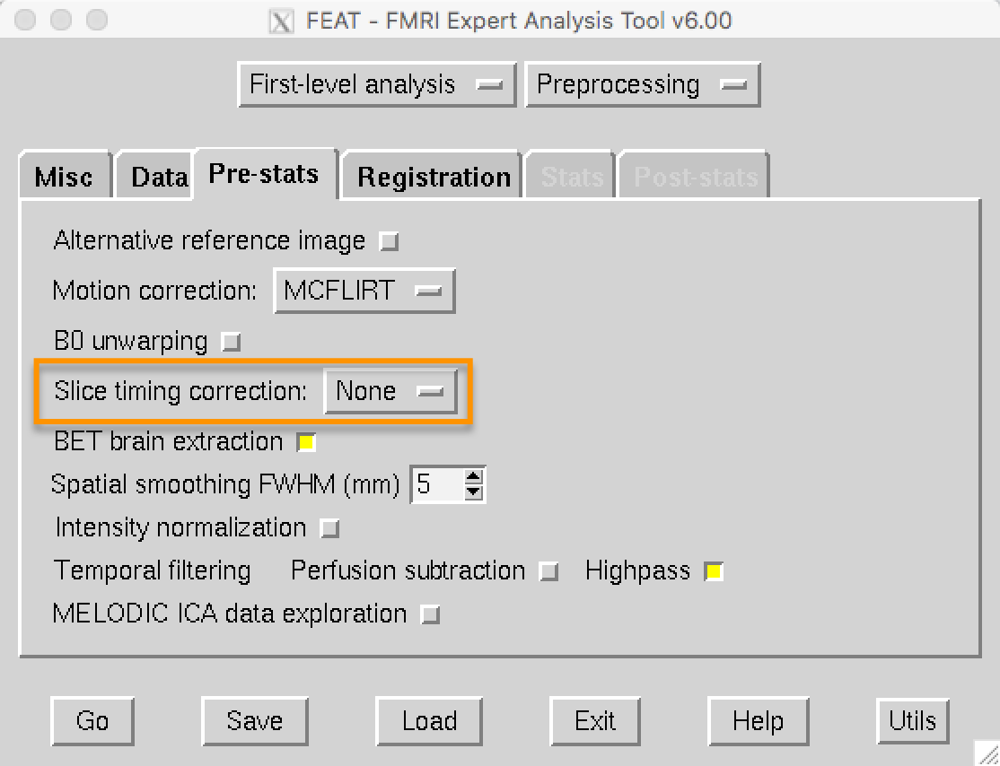

.. _Slice_Timing_Correction.rst

第4节: 切片时间校正
^^^^^^^^^^

与照片不同，照片是在一个瞬间拍摄整个画面，而fMRI体积是以 **切片** 的形式获取的。每个切片的获取都需要时间——从几十到几百毫秒不等。

创建三维图像的两种最常用方法是顺序切片采集和交错切片采集。顺序切片采集按顺序获取每个相邻的切片，可以是从下到上，也可以是从上到下。交错切片采集则是先获取每隔一片的切片，然后在第二次扫描时填补间隙。这两种方法在下面的视频中进行了演示。

.. figure:: SliceTimingCorrection_Demo.gif

正如您稍后会看到的，当我们对每个体素的数据进行建模时，我们假设所有切片是同时获取的。为了使这一假设成立，需要将每个切片的 :ref:`时间序列 <Time_Series>` 向前调整，调整的时间等于获取该切片所需的时间。 `Sladky等人（2011） <https://www.sciencedirect.com/science/article/pii/S1053811911007245>`__  还证明，对于具有较长TR（例如2秒或更长）的研究，切片时间校正可以显著提高统计效能，尤其是在大脑背侧区域。

尽管切片时间校正看起来合理，但也存在一些反对意见：

1. 通常情况下，除非必要，最好不要对数据进行插值（即编辑）；

2. 对于较短的TR（例如大约1秒或更短），切片时间校正似乎不会显著提高统计效能；以及

3. 切片时间校正解决的许多问题可以通过在统计模型中使用 **时间导数** 来解决（将在模型拟合章节中讨论）。

FSL的默认设置是不进行切片时间校正，而是包含一个时间导数。稍后，您将进行一个练习，比较使用和不使用切片时间校正的数据，以观察其差异有多大。

在 ``Pre-stats`` 选项卡中，我们将介绍的最后一个预处理步骤是平滑处理。要了解什么是平滑处理以及如何使用它，请点击“下一步”按钮。
