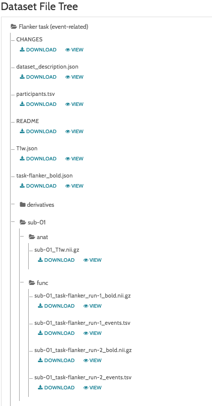

.. _fMRI_01_DataDownload:

==============
fMRI教程 #1: 下载数据
==============

概述
--------------

在本课程中，我们将分析一个使用了Flanker任务的fMRI数据集。该数据集可以在 `OpenNeuro <https://openneuro.org>`__ 网站上找到，链接为 `这里 <https://openneuro.org/datasets/ds000102/versions/00001>`__。（如果该网页上的下载链接无法使用，请点击 `这里 <https://legacy.openfmri.org/dataset/ds000102/>`__，然后点击“All data for subjects”链接。）

    OpenNeuro页面上的Flanker数据集包含一个数据集文件树，其中包括 ``anat`` 文件夹（包含解剖图像）和 ``func`` 文件夹（包含每次运行的功能图像和起始时间）。此外，还有一些包含受试者数据的文件，例如性别和年龄（ ``participants.tsv``），以及扫描参数（ ``task-flanker_bold.json``）。这种标准化的目录结构使脚本编写更加简单，我们将在后续教程中看到这一点。

通过点击页面顶部的 ``Download`` 按钮下载数据集。数据集大约有2GB大小，以压缩文件夹的形式提供。双击文件夹解压缩，然后将其移动到桌面上。

.. figure:: OpenNeuro_DownloadButton.png

下载并解压缩数据集后，点击 ``Next``按钮查看本研究中使用的实验任务概述。

备用下载选项
****************************

如果 ``Download`` 按钮无法使用，可以尝试使用 `Amazon Web Services (AWS) <https://aws.amazon.com/>`__ 选项。访问 `此页面 <https://aws.amazon.com/cli/>`__ 并下载适合您操作系统的AWS客户端。安装完成后，打开终端，导航到桌面，并输入以下命令：

::

    aws s3 sync --no-sign-request s3://openneuro.org/ds000102 ds000102-download/

下载大约需要半小时。
