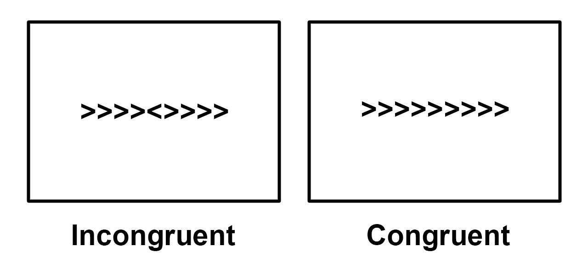
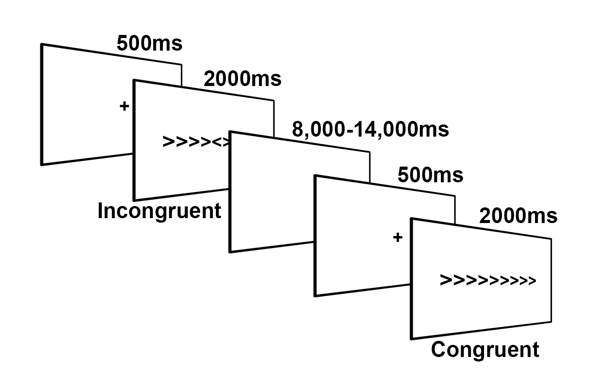

.. _fMRI_02_ExperimentalDesign:

==============  
fMRI教程 #2: Flanker任务概述  
==============  

您下载的数据集使用了Flanker任务，该任务旨在研究一种被称为认知控制的心理过程。在本课程中，我们将认知控制定义为忽略无关刺激以正确完成任务的能力。

在Flanker任务中，箭头指向左或右，受试者被指示按下两个按钮之一，表示中间箭头的方向。如果箭头指向左，受试者按下“左”按钮；如果箭头指向右，受试者按下“右”按钮。中间的箭头被其他箭头包围，这些箭头要么与中间箭头指向相同方向，要么指向相反方向。

    Flanker任务两种条件的示例。在“不一致”条件下，受试者关注的中间箭头与两侧箭头的方向相反；在“一致”条件下，中间箭头与两侧箭头的方向相同。在此示例中，“不一致”条件下的正确反应是按下“左”按钮，而“一致”条件下的正确反应是按下“右”按钮。要亲自体验Flanker任务，请点击 `这里 <http://cognitivefun.net/test/6>`__ 。

您可以想象，如果中间箭头的方向与两侧箭头相同，任务会更容易；如果方向相反，任务会更困难。我们将前者称为“一致”条件，后者称为“不一致”条件。受试者在“不一致”条件下通常反应较慢且准确率较低，而在“一致”条件下反应较快且准确率较高。由于反应时间的差异是显著且可靠的，因此在我们的fMRI数据中，我们应该也能能够看到 :ref:`BOLD signal <BOLD_Response>`.

    本研究中Flanker任务的示意图，改编自Kelly等人（2008）。受试者首先看到一个注视点以集中注意力在屏幕中央，然后呈现一个“一致”或“不一致”的Flanker试验，持续2000毫秒。在试验期间，受试者按下“左”或“右”按钮。随后是一个抖动间隔，持续时间从8000毫秒到14000毫秒不等。（注意，抖动间隔通常以秒为单位递增；在本例中，每次试验的抖动间隔将从以下随机选择：8000毫秒、9000毫秒、10000毫秒、11000毫秒、12000毫秒、13000毫秒和14000毫秒。）接着呈现另一个注视点以开始下一次试验。

我们的目标是估计每种条件下BOLD信号的幅度，然后 **对比** （即计算两种条件的差异）以确定它们是否显著不同。

.. note::  
    对任务的描述提出了一个关于设计fMRI研究的良好实践的重要观点：如果您能够设计一个产生强大且可靠效果的行为任务，您将增加在成像数据中发现效果的几率。fMRI数据以噪声著称——如果您的研究中没有观察到行为效果，那么您很可能也不会在成像数据中发现效果。
