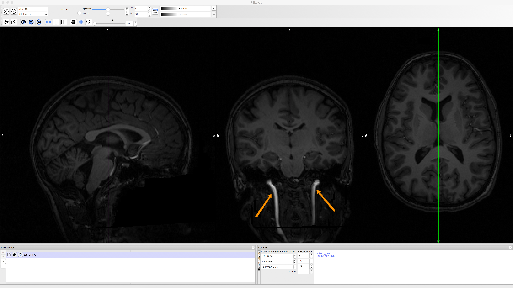
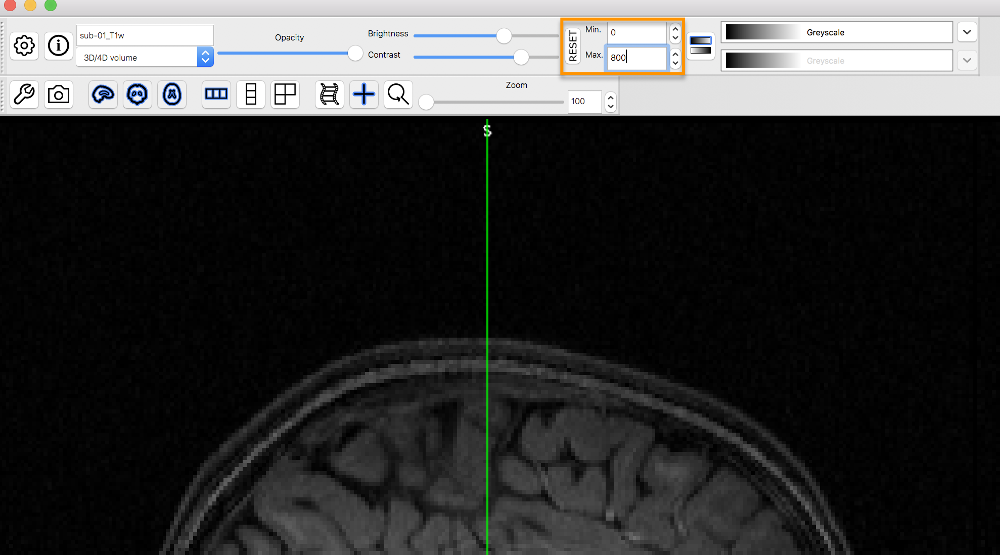

.. _fMRI_03_LookingAtTheData:

================
fMRI教程 #3: 查看数据
================

概述
---------

现在您已经下载了数据集，让我们看看它的样子。如果数据集已下载到您的“下载”目录，请导航到桌面并输入以下命令：

::

    mv ~/Downloads/ds000102_0001/ Flanker
    
这将把文件夹重命名为 ``Flanker`` 并将其放在您的桌面上。

.. figure:: Move_Flanker_Folder.png

    下载Flanker数据集后，输入上述命令将其移动到您的桌面。
    
    
正如您在前面的 :ref:`数据下载页面 <fMRI_01_DataDownload>` 中看到的，数据集具有标准化结构：每个受试者文件夹包含一个解剖目录和一个功能目录，分别标记为 ``anat`` 和 ``func`` ，这些目录又分别包含解剖图像和功能图像。 （ ``func`` 目录还包含 **开始时间**，即受试者经历一致或不一致试验的时间戳。）这种格式称为 `BIDS <http://bids.neuroimaging.io/>`__，即脑成像数据结构，便于组织和查找数据。

.. figure:: Flanker_DataStructure.png

    BIDS 格式示例。 请注意，``func`` 目录包含功能数据 - 在这种情况下，两个功能数据的运行 - 以及相应的 "events.tsv" 文件，这些文件包含 **开始时间**，即哪个条件在什么时间发生的时间戳。 您可以将这些文件作为文本文件或电子表格打开。

--------

检查解剖图像
----------
    
每当您下载成像数据时，请检查解剖图像和功能图像，以检查它们是否存在任何问题 - 扫描仪尖峰、方向错误、对比度差等等。 这需要一些时间来培养对这些问题的识别能力，但随着时间的推移，您会发现识别这些问题变得越来越快、越来越容易。

让我们来看看 ``sub-08`` 的 ``anat`` 文件夹中的解剖图像。导航到 sub-08 文件夹，然后输入

::

    fsleyes anat/sub-08_T1w.nii.gz
    
这将在 ``fsleyes`` 中打开解剖图像，FSL 的图像查看器。

    在 fsleyes 中显示的解剖图像。灰质和白质之间的对比度似乎很低，但这是因为颈部的血管（橙色箭头所示）比大脑的其余部分亮得多。
    

    通过更改对比度框中的数值可以解决此问题。 在这里，已将最大值降低到 800，从而将最亮信号限制为该值。 这使得更容易看到组织之间的对比度。
    
    
    
通过单击并拖动鼠标来检查图像。 您可以通过单击相应窗口来切换查看窗格。 请注意，随着您在图像上移动鼠标，其他窗口会实时更新。 这是因为 MRI 数据是作为三维图像收集的，沿一个维度移动会改变其他窗口的内容。

.. note::

    您可能已经注意到，这个受试者似乎缺少了他的面部特征。 这是因为来自 OpenNeuro.org 的数据已被 **去标识化**：不仅扫描日期和姓名等信息已从头文件中删除，而且面部特征也已被擦除。 这样做是为了确保受试者的匿名性。
    

在您继续检查图像时，以下是您可以注意的两件事：

1. 看起来像水塘中的涟漪的线条。 如果涟漪足够大，可能是由于受试者在扫描过程中移动过多引起的，并且如果涟漪足够大，它们可能会导致脑部提取或标准化等预处理步骤失败。

.. 还包括 QC 讲座中的图片？

2. 灰质或白质内部的异常强度差异。 这些可能表明存在动脉瘤或血管畸形等病理情况，应立即报告给放射科医生；确保您熟悉您所在实验室报告伪影的协议。 有关您可能在 MRI 图像中看到的病理情况的画廊，请点击 `这里 <http://www.mrishark.com/brain1.html>`__。

----------

检查功能图像
----------
    
当您查看完解剖图像后，点击屏幕顶部菜单中的 ``Overlay -> Remove All``。 然后，单击 ``File -> Add from File``，导航到 ``sub-08`` 的 func 目录，选择以 ``run-1_bold.nii.gz`` 结尾的图像。 这幅图像看起来也像是一幅大脑图像，但由于 **分辨率** 较低，因此不如解剖图像清晰。 通常情况下，研究会收集高分辨率的 T1 加权（即解剖）图像和低分辨率的功能图像，部分原因是我们收集功能图像的速度要快得多。

.. figure:: functional_firstLook.png

检查功能图像的许多质量与检查解剖图像的质量相同：注意灰质或白质中是否有极亮或极暗的斑点，以及图像是否有异常拉伸或变形等失真现象。 畸变通常出现在大脑的眼眶额部位，眼球正上方。 有一些方法可以减少这种失真，但现在我们将忽略它。

.. 参考时间序列词汇表

另一个质量检查是确保没有过度运动。 功能图像通常作为时间序列收集； 也就是说，多个体积被串联到一个数据集中。 您可以通过单击 fsleyes 中的电影卷轴图标像翻书一样快速翻阅所有卷。 注意任何查看窗格中的突然、剧烈的运动。 在预处理过程中，我们将量化运动的程度，以决定是保留还是丢弃该受试者的数据。

--------

