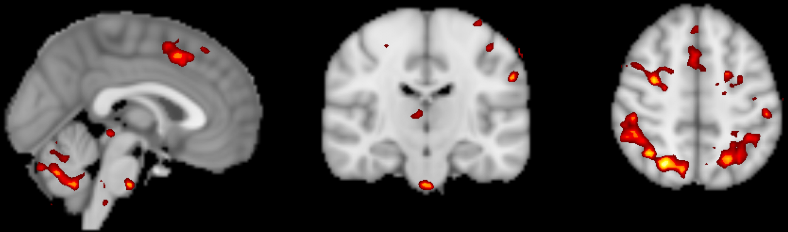

.. _fMRI_Intro:

============  
简介  
============  

本课程将向您展示如何从头到尾分析一个fMRI数据集。我们将从 **下载一个示例数据集**并检查每个受试者的解剖图像和功能图像开始。然后我们将 **预处理数据**，以去除噪声并增强图像中的信号。在图像预处理完成后，我们将创建一个模型，表示我们认为图像中应该出现的:ref:`BOLD信号 <BOLD_Response>`（一种神经活动的测量指标）。在 **模型拟合**过程中，我们将此模型与图像中不同区域的信号进行比较。模型拟合是信号在不同条件下强度的度量——例如，我们可以比较实验条件A和条件B之间的信号差异，以查看哪个条件导致更大的BOLD响应。

一旦为每个受试者创建了模型，并估计了每个条件的BOLD响应，我们可以进行任何类型的组分析：配对t检验、组间t检验、交互作用等。本课程的目标是计算两个条件之间的简单被试内对比，并测试其在受试者间是否显著。您还将学习如何创建类似于神经影像学期刊中发表的全脑分析图，以及如何进行感兴趣区域（ROI）分析。

    本课程使用的数据的组水平结果图，表示为z统计量图。颜色越亮表示z分数越大。您将从预处理原始数据开始，最终创建一个类似这样的统计图。  

本课程旨在增强您处理fMRI数据的信心，提高您对fMRI分析基本术语的熟悉程度，并帮助您在每一步中做出明智的选择。一些章节包含练习，用于练习您所学的内容并为下一章做好准备。一旦掌握了本课程的基础知识，您将能够将其应用于您选择的其他数据集。  

.. note::  
    我们不会深入讨论MRI物理学。关于该主题的回顾，我推荐Huettel、Song和McCarthy编写的书籍《Functional Magnetic Resonance Imaging》（第3版）的第1-5章。此外，请参阅Allen Elster的优秀网站 `MRI Questions <http://mriquestions.com/index.html>`__，其中包含MRI概念的有用插图。

