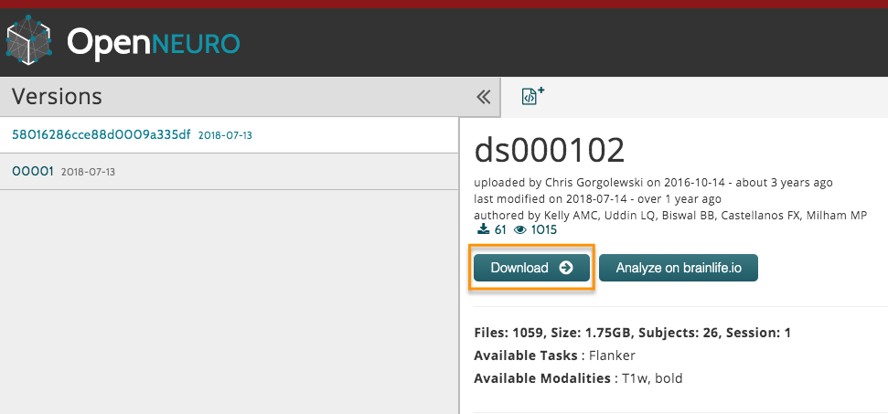

.. _fMRI_01_DataDownload:

==============
fMRI(FSL) 第一章: 下载数据
==============

概述
--------------

对于本课程，我们将分析一个使用 Flanker 任务的 fMRI 数据集。该数据集可以在 `OpenNeuro <https://openneuro.org>`__ 网站的 `ds000102 <https://openneuro.org/datasets/ds000102/versions/00001>`__ 下载。(如果上面的链接失效了, 可以在 `这里 <https://legacy.openfmri.org/dataset/ds000102/>`__ 下载，点击 "all data for subjects" 。)

.. figure:: OpenNeuro_Flanker.png

    Flanker 数据集的 OpenNeuro 页面包括一个数据集文件树，其中包含 ``anat`` （包含解剖图像）和 ``func`` （包含每次运行的功能图像和起始时间）文件夹。还有其他包含受试者数据（如性别和年龄（ ``participants.tsv`` ））和扫描参数（ ``task-flanker_bold.json`` ）的文件。像这样的标准化目录树使脚本编写变得容易得多，正如我们将在后面的教程中看到的那样。

    
    
通过点击页面顶部的 “下载” 按钮下载数据集。数据集约 2 GB，以压缩文件夹的形式提供。通过双击文件夹进行解压，然后将其移动到您的桌面。

在您下载并解压数据集后，点击 “下一步” 按钮以获取本研究中使用的实验任务的概述。

替代下载选项
****************************

如果下载按钮不起作用，请尝试使用 `Amazon Web Services (AWS) <https://aws.amazon.com/>`__ 下载. 需要先在 `这个页面 <https://aws.amazon.com/cli/>`__ 下载合适的AWS客户端。 一旦安装完成，打开一个终端，导航到桌面，并输入以下内容：

::

    aws s3 sync --no-sign-request s3://openneuro.org/ds000102 ds000102-download/

下载大约需要半小时。

