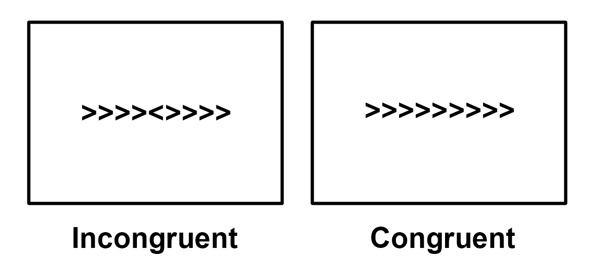
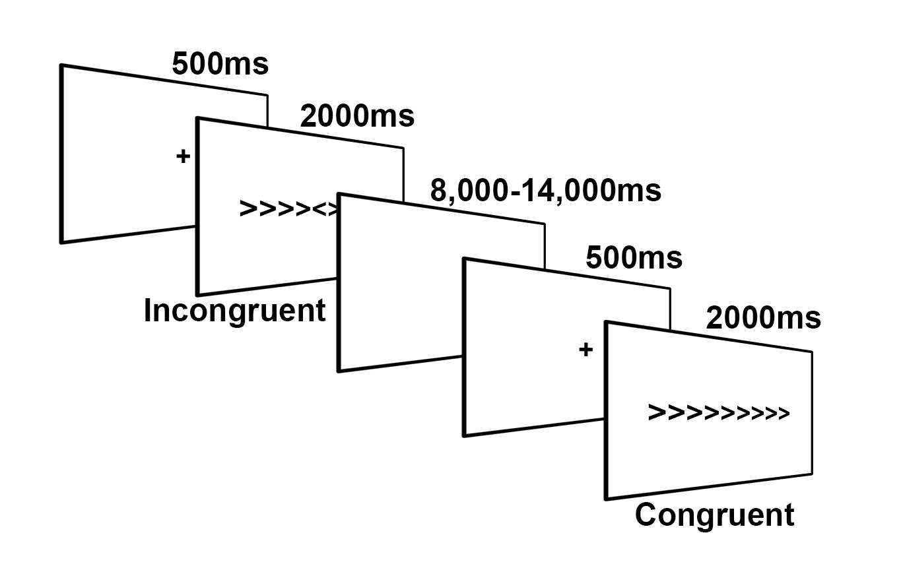

.. _fMRI_02_ExperimentalDesign:

==============
fMRI(FSL) 第二章: Flanker 任务概述
==============

您下载的数据集使用了 Flanker 任务，该任务旨在挖掘一种称为认知控制的心理过程。在本课程中，我们将认知控制定义为忽略不相关刺激以正确完成任务的能力。

在 Flanker 任务中，箭头指向左边或右边，受试者被指示按下两个按钮中的一个，以指示中间箭头的方向。如果指向左边，受试者按下 “左” 按钮；如果指向右边，受试者按下 “右” 按钮。中间的箭头两侧有其他箭头，这些箭头要么与中间的箭头指向相同的方向，要么指向与中间箭头相反的方向。

	Flanker 任务两种情况的一个示例。在不一致的条件下，中心箭头（受试者关注的）指向与侧翼箭头相反的方向；在一致的条件下，中心箭头指向与侧翼箭头相同的方向。在这个例子中，不一致条件下的正确反应是按下 “左” 按钮，一致条件下的正确反应是按下 “右” 按钮。要自己体验一下 Flanker 任务, 点击 `这里 <http://cognitivefun.net/test/6>`__.

您可以想象，如果中心箭头与侧翼箭头指向相同的方向，任务会更容易，如果指向相反的方向，任务会更困难。我们将前者称为 “一致” 条件，后者称为 “不一致” 条件。受试者在不一致条件下通常反应更慢且准确性更低，在一致条件下反应更快且准确性更高。由于反应时间的差异是显著且可靠的，因此在我们的 fMRI 数据中，我们应该也会看到 :ref:`BOLD 信号 <BOLD_Response>` 显著不同.

	本研究中 Flanker 任务的图示，改编自 Kelly 等人（2008 年）。向受试者展示一个注视十字以使其专注于屏幕中心，然后呈现 2000 毫秒的一致或不一致的 Flanker 试验。在试验期间，受试者按下左或右按钮。随后是一个抖动间隔，持续时间从 8000 毫秒到 14000 毫秒不等。（请注意，抖动间隔通常以秒递增；在这种情况下，给定试验的抖动将是以下随机选择之一：8000 毫秒、9000 毫秒、10000 毫秒、11000 毫秒、12000 毫秒、13000 毫秒和 14000 毫秒）呈现另一个注视十字以开始下一次试验。

我们的目标是估计每种条件下 BOLD 信号的大小，然后进行 **对比**（即，取两者的差）这两种条件，看它们是否彼此显著不同。

.. note::
	对该任务的这一描述提出了关于设计 fMRI 研究的良好实践的一个重要观点：如果您能够设计一个产生强大且可靠效果的行为任务，您将增加在成像数据中发现效果的几率。fMRI 数据众所周知是有噪声的 —— 如果在您的研究中没有看到行为效果，您很可能在成像数据中也找不到效果。
