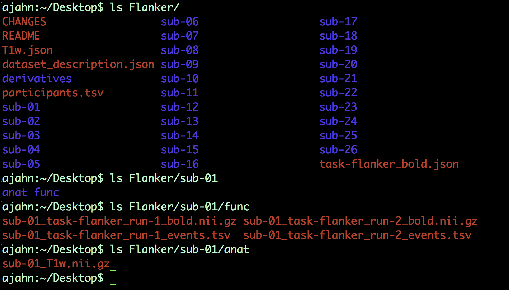

.. _fMRI_03_LookingAtTheData:

.. |movieIcon|  image:: movieIcon.png

================
fMRI(FSL) 第三章: 查看数据
================

概述
---------

既然您已经下载了数据集，让我们看看它是什么样子。如果数据集已下载到您的 “下载” 目录，请导航到桌面并输入以下内容：

::

    mv ~/Downloads/ds000102_0001/ Flanker
    
这将把文件夹重命名为 ``Flanker`` 并将其放在您的桌面上。

    下载 Flanker 数据集后，输入上述命令将其移动到您的桌面。
    
    
正如您在前文中所见 :ref:`数据下载 <fMRI_01_DataDownload>`,该数据集具有标准化的结构：每个受试者文件夹包含一个解剖目录和一个功能目录，分别标记为 ``anat`` 和 ``func`` ，而这些目录又分别包含解剖图像和功能图像。（ ``func`` 目录还包含起始时间，即受试者进行一致或不一致试验的时间戳。） 这种格式被称为 `BIDS <http://bids.neuroimaging.io/>`__ ，即脑成像数据结构，这使得组织和查找您的数据变得容易。

    BIDS 格式的示例。请注意， ``func`` 目录包含功能数据 - 在这种情况下，两次功能数据运行 - 以及相应的 “events.tsv” 文件，其中包含 **起始**，即哪种条件在何时发生的时间戳。您可以将这些作为文本文件或电子表格打开。

--------

检查解剖图像
----------
    
无论何时下载成像数据，都要检查解剖图像和功能图像，以检查是否存在任何问题 —— 扫描仪尖峰、方向不正确、对比度差等等。培养出识别这些问题的眼力需要一些时间，但通过练习，这会变得更快、更容易。

让我们看一下 ``sub-08`` 的 ``anat`` 文件夹中的解剖图像。导航到 sub-08 文件夹，然后输入

::

    fsleyes anat/sub-08_T1w.nii.gz

这将在 FSL 的图像查看器 ``fsleyes`` 中打开解剖图像。
    

.. figure:: anat_firstLook.png

    在 fsleyes 中显示的解剖图像。灰质和白质之间的对比度似乎较低，但这是因为颈部的血管（橙色箭头所示）比大脑的其他部分亮得多。
    
.. figure:: anat_changeContrast.png

    这可以通过更改对比度框中的数字来修复。在这里，最大值已降低到 800，将最亮的信号限制在该值。这使得更容易看到组织之间的对比度。
    
    
    
通过点击并拖动鼠标来检查图像。您可以通过在相应的窗口中点击来切换查看窗格。请注意，当您移动鼠标时，其他窗口会实时更新。这是因为 MRI 数据是作为三维图像收集的，沿着其中一个维度移动也会改变其他窗口。

.. note::

    您可能已经注意到这个受试者似乎没有脸。那是因为来自 OpenNeuro.org 的数据已经被去 **标识化** 了：不仅诸如姓名和扫描日期之类的信息已从头部被删除，而且脸也被抹去了。这样做是为了确保受试者的匿名性。
    

当您继续检查图像时，这里有两件事您可以留意：

1. 看起来像池塘里涟漪的线条。这些涟漪可能是由受试者在扫描过程中移动过多引起的，如果涟漪足够大，可能会导致像脑提取或标准化这样的预处理步骤失败。

.. Also include pictures from the QC talk?

2. 灰质或白质内的异常强度差异。这些可能表明存在诸如动脉瘤或海绵状血管瘤之类的病变，应立即向您的放射科医生报告；确保您熟悉实验室报告伪影的规程。有关您可能在 MRI 图像中看到的病变图库，请点击 `这里 <http://www.mrishark.com/brain1.html>`__.

----------

检查功能图像
----------
    
当您看完解剖图像后，在屏幕顶部的菜单中点击 ``Overlay -> Remove All`` 。然后，点击 ``File -> Add from File`` ，导航到 ``sub-08`` 的 func 目录，并选择以 ``run-1_bold.nii.gz`` 结尾的图像。此图像看起来也像大脑，但不如解剖图像清晰。这是因为分辨率较低。一项研究通常会收集高分辨率的 T1 加权（即解剖）图像和低分辨率的功能图像，部分原因是我们收集功能图像的速度要快得多。

对于功能图像的许多质量检查与解剖图像相同：留意灰质或白质中极亮或极暗的斑点，以及图像失真，如异常拉伸或扭曲。一个常见到有点失真的地方是大脑的眶额叶部分，就在眼球上方。有办法减少这种失真，但现在我们先忽略它。

.. Reference the timeseries glossary

另一个质量检查是确保没有过度的运动。功能图像通常作为时间序列收集；也就是说，多个体素被连接在一起形成一个单一的数据集。您可以通过点击 fsleyes 中的电影胶片图标像翻阅一本书的页面一样快速浏览所有体素。注意任何查看窗格中的任何突然、急促的运动。在预处理期间，我们将量化有多少运动，以决定是保留还是丢弃该受试者的数据。

