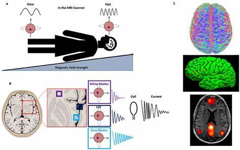

Welcome to SP's MRI Book!
=============================

你好！这本书，SP's MRI Book 基于 Andy’s Brain Book修改而来，是为那些想要学习如何分析磁共振成像的人而设计的，尤其对与那些有科研需求的研究人员。

.. note::

    使用稍大一点的字体大小阅读这本书会更容易；我建议使用 125% 的缩放比例。在 Macintosh 上，你可以按住 “Command” 键并按 “+” 来实现，或者从浏览器菜单中点击 “查看 -> 放大”。    

.. toctree::
   :maxdepth: 1
   :caption: Install

   installation/fsl_mac_install
   
   
.. toctree::
    :maxdepth: 1
    :caption: 影像人的简易UNIX教程
    
    unix/Unix_Intro
    unix/Unix_01_Navigation
    unix/Unix_02_CopyRemove
    unix/Unix_03_ReadingTextFiles
    unix/Unix_04_ShellsVariables
    unix/Unix_05_ForLoops
    unix/Unix_06_IfElse
    unix/Unix_07_Scripting
    unix/Unix_08_Sed
    unix/Unix_09_AutomatingTheAnalysis
    
    
.. toctree::
    :maxdepth: 1
    :caption: fMRI Short Course with FSL
    
    fMRI_Short_Course/fMRI_Intro
    fMRI_Short_Course/fMRI_01_DataDownload
    fMRI_Short_Course/fMRI_02_ExperimentalDesign
    fMRI_Short_Course/fMRI_03_LookingAtTheData
    fMRI_Short_Course/fMRI_04_Preprocessing
    fMRI_Short_Course/fMRI_05_1stLevelAnalysis
    fMRI_Short_Course/fMRI_06_Scripting
    fMRI_Short_Course/fMRI_07_2ndLevelAnalysis
    fMRI_Short_Course/fMRI_08_3rdLevelAnalysis
    fMRI_Short_Course/fMRI_09_ROIAnalysis
    fMRI_Short_Course/fMRI_10_Summary
    fMRI_Short_Course/fMRI_Appendices
    
    
.. toctree::
    :maxdepth: 1
    :caption: FreeSurfer
    
    FreeSurfer/FreeSurfer_Introduction
    
.. toctree::
    :maxdepth: 1
    :caption: E-Prime
    
    E-Prime/E-Prime_Overview
    
.. toctree::
    :maxdepth: 1
    :caption: AFNI

    AFNI/AFNI_Overview
    
.. toctree::
    :maxdepth: 1
    :caption: SPM

    SPM/SPM_Overview
    
.. toctree::
    :maxdepth: 1
    :caption: Functional Connectivity with the CONN Toolbox
    
    FunctionalConnectivity/CONN_Overview
    
.. toctree::
    :maxdepth: 1
    :caption: Parametric Modulation
    
    PM/PM_Overview

.. note::

    The following modules are under construction. Check back soon for more updates!
    
.. toctree::
   :maxdepth: 1
   :caption: Image Visualization with MRIcroGL
   
   MRIcroGL/MRIcroGL_Overview
   
.. toctree::
   :maxdepth: 1
   :caption: Introduction to the Human Connectome Project (HCP)
   
   HCP/HCP_Overview
    
.. toctree::
   :maxdepth: 1
   :caption: Finite Impulse Response (FIR) Models
   
   FIR/FIR_Overview

.. toctree::
   :maxdepth: 1
   :caption: fMRI Concepts

   Practicals/DesignOptimization
    
.. toctree::
    :maxdepth: 1
    :caption: Diffusion Analysis with MRtrix
    
    MRtrix/MRtrix_Introduction
   
.. toctree::
    :maxdepth: 1
    :caption: ASL Analysis
    
    ASL/ASL
    ASL/ASL_Techniques
    ASL/fASL_02_Download
    ASL/fASL_03_Task
    ASL/04_fASL_GUI
    ASL/05_fASL_Results
    ASL/06_fASL_Quantification
    
    
.. toctree::
    :maxdepth: 1
    :caption: Frequently Asked Questions
    
    FrequentlyAskedQuestions/FrequentlyAskedQuestions.rst
    
    
.. toctree::
    :maxdepth: 1
    :caption: Statistics
    
    Statistics/GIMME
    
.. toctree::
    :maxdepth: 1
    :caption: Miscellaneous
    
    Miscellaneous/ConvertingDICOMs
    
.. toctree
    :maxdepth: 1
    :caption: Multi-Voxel Pattern Analysis (MVPA)
    
    MVPA/MVPA_Overview
    
.. toctree::
    :maxdepth: 1
    :caption: Open Science
    
    OpenScience/OS_Overview
    
.. toctree::
    :maxdepth: 1
    :caption: Advanced Normalization Tools (ANTs)
    
    ANTs/ANTs_Overview
    
.. toctree::
    :maxdepth: 1
    :caption: Tract-Based Spatial Statistics (TBSS)
    
    TBSS/TBSS_Overview

.. toctree::
    :maxdepth: 1
    :caption: Statistics for Neuroimagers
    
    Stats/Stats_Overview
    
.. toctree::
    :maxdepth: 1
    :caption: Machine Learning for Neuroimagers
    
    ML/ML_Overview
    
.. toctree::
    :maxdepth: 1
    :caption: Slicer
    
    Slicer/Slicer_Overview
    
.. toctree::
    :maxdepth: 1
    :caption: CAT12
    
    CAT12/CAT12_Overview
    
.. toctree::
    :maxdepth: 1
    :caption: Using the Supercomputer
    
    Supercomputer/Supercomputer_Overview
    
    
.. toctree::
    :maxdepth: 1
    :caption: Matlab for Neuroimagers
    
    Matlab/Matlab_Overview
    
    
.. toctree::
    :maxdepth: 1
    :caption: ITK-Snap
    
    ITK-Snap/ITK-Snap_Overview
    
.. toctree::
    :maxdepth: 1
    :caption: Python for Neuroimagers
    
    PythonForNeuroimagers/PythonForNeuroimagers_Overview

.. toctree::
    :maxdepth: 1
    :caption: Meta-Analysis for fMRI
    
    MetaAnalysis/MetaAnalysis_Overview

.. Glossary
.. ==================

.. * :ref:`terms`

.. note::
    This book is under construction. More chapters will be added in the coming weeks; my goal is to have a complete draft of the fMRI Short Course by the first week of June.
    
    4.24.2019: Finished the sections Unix Tutorial #4, fMRI Short Course chapters on smoothing and quality checking FEAT output, and added a playlist covering all of the sections done in the Preprocessing module.
    
    5.06.2019: Added sections to FAQ about resampling, biased analyses, and flipped orientations. Wrote the chapters for the Statistics part of the short course; videos coming soon.
    
    5.25.2019: Finished the Unix Module, and added videos for 2nd and 3rd level analysis in the fMRI short course.
    
    5.31.2019: First draft of the Unix and fMRI courses are complete.
    
    10.14.2019: E-Prime module is complete.

    10.16.2019: FreeSurfer module complete.
    
    1.13.2020: SPM written module complete (videos not up yet)
    
    4.13.2020: SPM videos uploaded

    5.21.2020: CONN Tutorials complete
    
    12.08.2020: First part of MVPA tutorial complete, from preprocessing to group-level analysis. Later on, will add other statistical analyses, such as prevalence analysis.
    
    01.20.2022: There is now a DOI for Andy's Brain Book! If you would like to cite it, use the following template: "We followed the AFNI preprocessing pipeline as outlined in Andy's Brain Book (Jahn, 2022. doi:10.5281/zenodo.5879293)."
