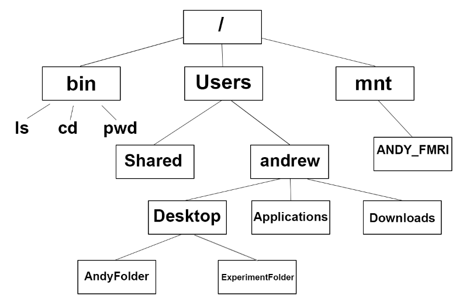
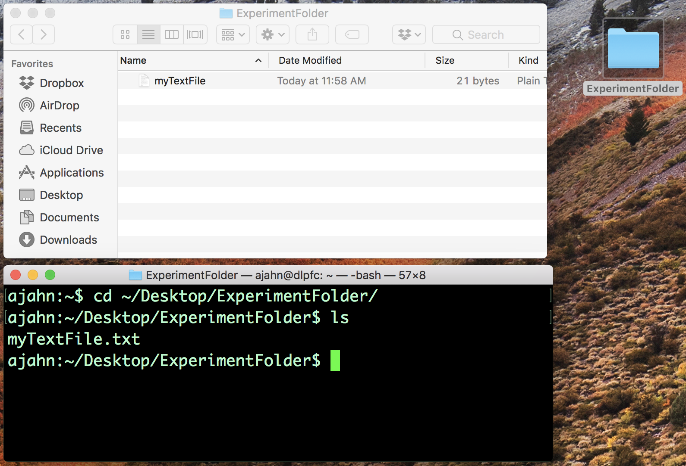

.. _Unix_01_Navigation:

===============================================
第一节: 目录操作
===============================================

.. note::
    主题: 目录, 目录导航
    
    命令: pwd, cd, ls

概述
--------

像其他操作系统一样，Unix 使用目录树来组织文件夹和文件——也称为目录层次结构或目录结构。在层次结构的顶部有一个名为 ``root`` 的文件夹，写作正斜杠 (``/``)。 所有其他文件夹（也称为目录）都包含在 ``root`` 文件夹, 而这些文件夹又可以包含其他文件夹。

将目录层级想象成一棵倒立的树: ``root`` 是这棵树的根基，所有其他文件夹都从它延伸出来，就如同树枝从树干延伸出来一样。

    root（用正斜杠（“/”）表示）是目录树的最高层级；它包含诸如 “bin”（其中包含可执行文件，或者诸如 pwd、cd、ls 等 Unix 命令）、“mnt”（显示任何当前已挂载的驱动器，例如外部硬盘驱动器）以及 “Users” 等文件夹。这些目录依次又包含其他目录 —— 例如，“Users” 包含文件夹 “andrew”，而 “andrew” 又包含 “Desktop”（桌面）、“Applications”（应用程序）和 “Downloads”（下载）目录。这就是文件夹和文件在目录树中的组织方式。
    

要在你的计算机中进行导航，你需要知道 “pwd”、“cd” 和 “ls” 这些命令。“pwd” 代表 “打印工作目录”；“cd” 代表 “改变目录”；“ls” 代表 “列出”，即 “列出当前目录的内容”。这类似于在你的桌面上指向并点击一个文件夹，然后查看里面有什么。请注意，在这些教程中，“文件夹” 和 “目录” 这两个词可以互换使用。

    在 Unix 中的导航与在典型的图形用户界面中进行指向并点击是一回事。例如，如果你在我的桌面上有一个 “ExperimentFolder”（实验文件夹）文件夹，你可以指向它并双击以打开它。你也可以在终端中输入 “cd ~/Desktop/ExperimentFolder”，然后输入 “ls” 以查看该目录中的内容，来实现同样的操作。

-------------

练习
---------

1.  输入 “ls ~” 并注意它返回的内容；然后输入 “ls ~/Desktop”。这两个输出有何不同？为什么？

2.  通过输入 “cd ~/Desktop” 导航到桌面。输入 “pwd” 并注意路径是什么。然后使用 “mkdir” 命令创建一个新目录，自己为这个目录选择一个名称。导航进入这个新目录，并思考一下你的当前路径是如何更新的。这与你在新目录中输入 “pwd” 所看到的内容一致吗？

3.  用你自己的话来定义 “cd”、“ls” 和 “pwd” 这几个术语。
