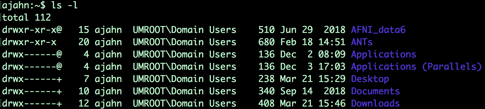
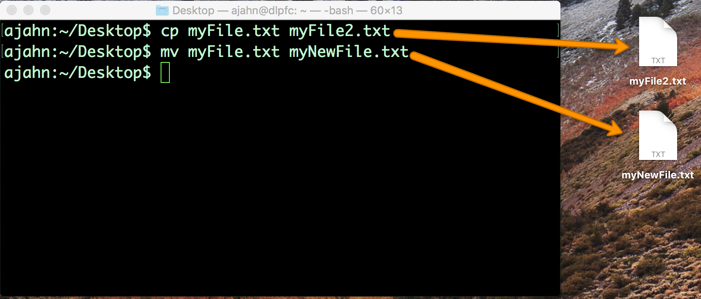

.. _Unix_02_CopyRemove:

============================================
第一节: : 复制、移动文件
============================================

.. note::
  主题：文件操作；参数；选项；复制、删除和重命名文件。

  需要的命令: cp, mv, rm

  既然你已经有了使用 “cd” 和 “ls” 在目录中进行导航的经验，现在让我们用 “cp”、“mv” 和 “rm” 命令来扩充我们的技能。这些是文件操作命令，类似于在文件上右键点击然后进行复制粘贴、重命名或移动到一个文件夹中，或者将其移动到回收站。“cp” 和 “mv” 命令比上一个教程中的命令更复杂，因为它们需要两个输入，即参数。我们还将使用这些命令来引入选项（即标志）的概念，它使你的命令具有更大的灵活性。

  使用带有 “-l” 选项的 “ls” 命令的一个例子，该选项以 “长格式” 列出文件和目录。这个选项扩展了 “ls” 命令的能力，使其不仅能列出文件名，还能显示关于文件最后更新时间、谁有权编辑文件以及文件大小等细节。  

为了查看使用图形界面和使用命令行之间的相似之处，在你选择的一个编辑器中创建一个文本文件，例如 TextEdit。将文件保存到你的桌面 —— 在这个例子中，我将把它命名为 myFile.txt—— 然后尝试以下命令，记住在每一行之后按下回车键：
::

  cp myFile.txt myFile2.txt
  mv myFile.txt myNewFile.txt
  rm myFile2.txt
  
第一行创建了一个 myFile.txt 的副本并将其标记为 myFile2.txt；第二行将 myFile.txt 重命名为 myNewFile.txt；最后一行删除 myFile2.txt。当你在命令行中输入这些命令时，你应该会看到文件被复制、重命名和删除 —— 就像你使用图形用户界面并用鼠标操作时一样。

  关于在终端中输入的命令与通过图形用户界面复制和重命名文件具有相同效果的示例说明。

.. warning::
  在删除文件和目录时，图形用户界面（GUI）和命令行之间有一个重要的区别。使用图形用户界面删除的文件首先会被放入回收站，并且只有当你选择清空回收站时才会被永久删除。另一方面，使用 “rm” 删除文件会立即永久删除该文件；用 “rm” 删除文件后，你将无法恢复该文件！

-----------

练习
-----------

1.  在你的主目录下创建一个新目录，然后在该目录中创建几个新文件，或者从另一个目录中将文件复制到这个新目录中。

2.  现在将这个目录复制到桌面，但是在你要复制的目录末尾添加一个正斜杠。例如，如果这个目录叫做 “myFolder”，输入 “cp -R myFolder/ Desktop”。会发生什么？

3.  输入 “man cp”，然后找到关于 “-R” 选项的部分。尝试将 “cp” 命令与其他选项一起使用，并观察会发生什么。
