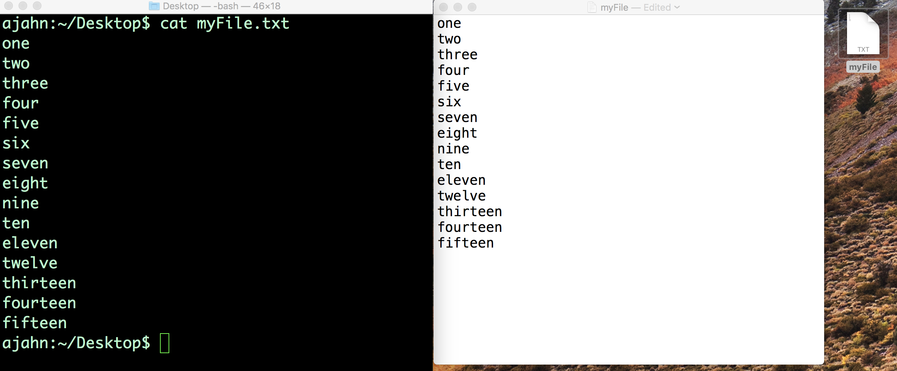

.. _Unix_03_ReadingTextFiles:

=======
第3节: 阅读文本文件
=======

.. note::
   主题: 文件操作, 重定向, 流, 标准输入, 标准输出, 标准错误
   
   使用命令: cat, less, head, wc

命令行对于查看和操作文本文件都很有用。**操作** 意味着编辑文本 —— 例如，在文本文件中替换单词，或者将命令行中的文本附加到文件末尾（也称为 “重定向”）。这对于创建 “脚本” 很有用，脚本是包含一个或多个连续运行的命令的文本文件。在后面的教程中，你将使用这些技术来自动化你的分析，这可以节省大量的时间。

你可以使用 ``cat`` 命令来显示文件的内容， ``cat``是 “concatenate（连接）” 的缩写。假设我们在桌面上有一个名为 “myFile.txt” 的文件，它包含从一到十五这些单词（即 one, two, three……fifteen），每个数字占一行。使用命令行导航到桌面，然后输入 ``cat myFile.txt``。这将把文件的内容打印到你的命令行中。这与使用图形用户界面双击文本文件以查看其内容是相同的概念。

使用命令行和图形用户界面来读取文本文件的内容。左边是使用 ``cat``命令的命令行，它将内容打印到终端。右边是使用鼠标双击文件后显示的文件内容。

我们将这个命令的输出称为 “标准输出（stdout）”，即标准输出流。输入到终端的命令被称为 “标准输入（stdin）”，即标准输入流。这涉及到 “流（streams）” 的概念，即信息流入和流出命令行的流程，我们将利用这些概念在操作文本文件时获得更大的灵活性。目前，你可以把 “标准输入（stdin）” 看作是你输入到终端的任何内容，把 “标准输出（stdout）” 看作是如果命令在没有任何错误的情况下运行所返回的内容。如果输入的命令确实导致了错误 —— 例如，因为命令拼写错误或者因为没有提供足够的参数 —— 输出到终端的文本被称为 “标准错误（stderr）”，即标准错误流。
.. figure:: Streams.png

   Unix 中关于流的图示。输入到终端的任何内容都是 “标准输入（stdin）”，并且如果它在没有错误的情况下运行，输出的任何内容都称为 “标准输出（stdout）”。如果有错误，输出则被称为 “标准错误（stderr）”。
   
The ``cat`` command is useful for viewing the contents of smaller files, but if the file contains hundreds of lines of text, it is overwhelming to have everything printed to the Terminal at once. To see only a part of the file, we can use the commands ``head`` and ``tail`` to see the first few or the last few lines of the file, respectively. Using myFile.txt as an example, typing

::

   head myFile.txt

Would return the first five lines; whereas typing

:: 

   tail myFile.txt

Would return the last five lines. Although the default is to return five lines, these commands have an option to display any amount of lines that you choose. For example,

::

   head -10 myFile.txt
   tail -10 myFile.txt

Would return the first ten lines and the last ten lines. Try these out yourself, changing the number of lines that are displayed.

Redirection
----------

In addition to displaying the results of a command, **stdout** can be used to move or append the output to a file, a concept known as **redirection**. For example, if you type 

::

   echo sixteen > tmp.txt

The word “sixteen” goes into the file tmp.txt instead of being written to standard output. Notice that it creates the file tmp.txt even if it doesn’t exist. However, if we try that again with another string - for example,

::

   echo seventeen > tmp.txt

It will overwrite the file with whatever we printed to standard output. If you want to append standard output to the end of a file without overwriting the other data in the file, use two greater-than signs. For example, type

::

   echo eighteen >> tmp.txt

If you type ``cat tmp.txt``, you will see both seventeen and eighteen.

Although these examples are trivial, redirection is invaluable for quickly editing text files and for writing **scripts**, which allow you to run analyses for hundreds or thousands of subjects with only a few lines of code.

----------

Exercises
----------

1. Create a new file called "tmp.txt" and type whatever you want into the file. Use ``cat`` to string together both the myFile.txt and tmp.txt files, and redirect the output to create a new file. Print the contents of the new file to stdout.

2. If you have AFNI installed on your machine, use ``less`` on the command ``3dcalc`` to find strings matching "Example." Now try it using the less command with an option to ignore whether the letters in the string are upper case or lower case. Hint: To find this option, search for the string "case" in the ``man`` file for ``less``. (If you have FSL installed instead of AFNI, try the same exercise with the command ``fslmerge``.)

3. Unix has a built-in command called ``sort`` which will sort text numerically or alphabetically. What happens when you use myFile.txt as an argument for ``sort``? What about typing this command:

::

   cat myFile.txt | sort

In your own words, explain the difference between the two methods.
