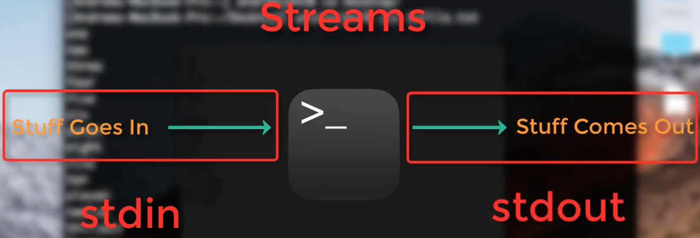

.. _Unix_03_ReadingTextFiles:

=======
第3节: 阅读文本文件
=======

.. note::
   主题: 文件操作, 重定向, 流, 标准输入, 标准输出, 标准错误
   
   使用命令: cat, less, head, >

命令行对于查看和操作文本文件都很有用。 **操作** 意味着编辑文本 —— 例如，在文本文件中替换单词，或者将命令行中的文本附加到文件末尾（也称为 **重定向**）。这对于创建 **脚本** 很有用，脚本是包含一个或多个连续运行的命令的文本文件。在后面的教程中，你将使用这些技术来自动化你的分析，这可以节省大量的时间。

你可以使用 ``cat`` 命令来显示文件的内容， 它是 **concatenate（连接）**  的缩写。假设我们在桌面上有一个名为 “myFile.txt” 的文件，它包含从一到十五这些单词（即 one, two, three……fifteen），每个数字占一行。使用命令行导航到桌面，然后输入 ``cat myFile.txt``。这将把文件的内容打印到你的命令行中。这与使用图形用户界面双击文本文件以查看其内容是相同的概念。

使用命令行和图形用户界面来读取文本文件的内容。左边是使用 ``cat``命令的命令行，它将内容打印到终端。右边是使用鼠标双击文件后显示的文件内容。

我们将这个命令的输出称为 c，即标准输出流。输入到终端的命令被称为 **标准输入（stdin）**，即标准输入流。这涉及到 **流（streams）**的概念，即信息流入和流出命令行的流程，我们将利用这些概念在操作文本文件时获得更大的灵活性。目前，你可以把 **标准输入（stdin）** 看作是你输入到终端的任何内容，把 **标准输出（stdout）** 看作是如果命令在没有任何错误的情况下运行所返回的内容。如果输入的命令确实导致了错误 —— 例如，因为命令拼写错误或者因为没有提供足够的参数 —— 输出到终端的文本被称为 **标准错误（stderr）**，即标准错误流。

   Unix 中关于流的图示。输入到终端的任何内容都是 **标准输入（stdin）**，并且如果它在没有错误的情况下运行，输出的任何内容都称为 **标准输入（stdin）**。如果有错误，输出则被称为 **标准错误（stderr）**。
   
``cat`` 命令对于查看较小文件的内容很有用，但如果文件包含数百行文本，一下子将所有内容都打印到终端会让人应接不暇。为了只查看文件的一部分，我们可以分别使用 ``head`` 和 ``tail``命令来查看文件的前几行或后几行。以 **myFile.txt** 为例，输入
::

   head myFile.txt

将返回前五行；而输入

:: 

   tail myFile.txt

将返回最后五行。虽然默认是返回五行，但这些命令有一个选项可以显示你选择的任意行数。例如

::

   head -10 myFile.txt
   tail -10 myFile.txt

将返回前十行和最后十行。你自己试试这些命令，改变显示的行数。

重定向
----------

除了显示命令的结果之外， **标准输出（stdout）** 还可以用于将输出移动或附加到一个文件中，这个概念被称为  **重定向**。例如，如果你输入

::

   echo sixteen > tmp.txt

单词 **sixteen** 会被写入文件 tmp.txt 而不是被写入标准输出。注意，即使 tmp.txt 文件不存在，它也会被创建。然而，如果我们再次用另一个字符串尝试 —— 例如
::

   echo seventeen > tmp.txt

它将用我们打印到标准输出的任何内容覆盖该文件。如果你想将标准输出附加到文件末尾而不覆盖文件中的其他数据，可以使用两个大于号。例如，输入

::

   echo eighteen >> tmp.txt

如果你输入 ``cat tmp.txt``，你将看到 **seventeen**   和 **eighteen**。 

:: 
   
   虽然这些例子很琐碎，但重定向对于快速编辑文本文件和编写 **脚本** 来说是非常宝贵的。 **脚本** 可以让你仅用几行代码就对数以百计或千计的对象进行分析。
----------

练习
----------

1. 创建一个名为 “tmp.txt” 的新文件，并在该文件中输入任何你想要的内容。使用 “cat” 命令将 “myFile.txt” 和 “tmp.txt” 两个文件的内容连接起来，然后将输出重定向以创建一个新文件。将新文件的内容打印到标准输出。

2. 如果你的机器上安装了 AFNI，在命令 “3dcalc” 上使用 “less” 来查找匹配 “Example” 的字符串。现在使用 “less” 命令并加上一个选项，以忽略字符串中的字母是大写还是小写来进行尝试。提示：要找到这个选项，可以在 “less” 的 “man” 文件中搜索字符串 “case”。（如果你安装的是 FSL 而不是 AFNI，使用命令 “fslmerge” 进行同样的练习。）

3. Unix 有一个内置命令叫做 “sort”，它可以按数字或字母顺序对文本进行排序。当你把 “myFile.txt” 作为 “sort” 的参数时会发生什么呢？那输入这个命令又会怎样呢：

::

   cat myFile.txt | sort

用你自己的话解释这两种方法之间的区别。