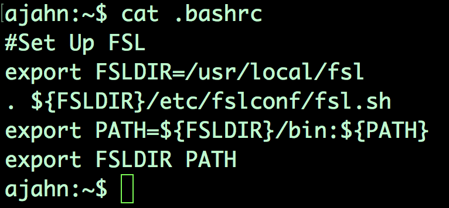
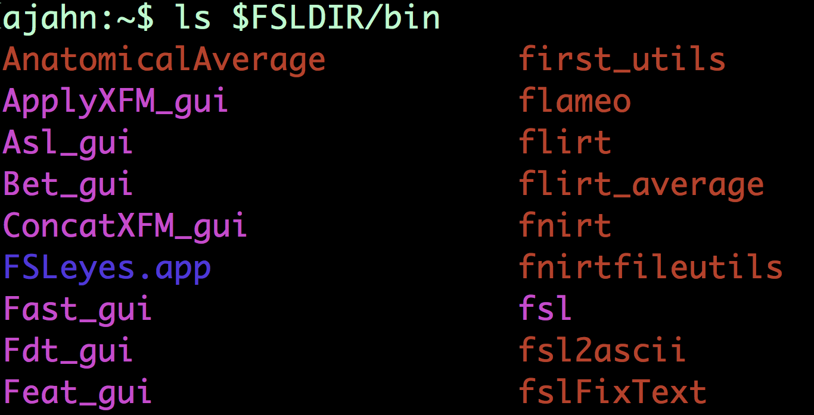

.. _Unix_04_ShellsVariables:

===========================================
第4节: 壳层（命令行解释器）与路径变量
===========================================

.. note::
  主题: paths, variables, shells, FSL, installation, syntax, redirection
  命令: set, setenv, export, tcsh, bash
  
  
现在你对 Unix 命令已经更加熟悉了，我们可以下载一个功能性磁共振成像（fMRI）软件包并使用 Unix 进行安装。如果你还没有下载 FSL，可以观看 `this video <https://youtu.be/E9FwDCYAto8?t=14>`__. 完成后，请回到本教程。

当你下载并安装了 FSL 时，你可能看到了一些你不完全理解的内容。例如，如果你转到你的主目录并输入 “cat .bashrc”，你会看到这一段代码。

要理解这意味着什么，你需要理解 shell、路径和变量。让我们从 **shell** 开始。可以把 shell 想象成一个你可以在其中输入 Unix 命令的环境。或者，把它想象成一个将你输入的内容转换为计算机实际执行的操作的解释器。在之前的教程中我们使用了一个 shell，但你可能没有意识到它。当你打开终端时，它使用一个 shell 来解释你正在输入的内容。此外，有许多不同的 shell，并且每个 shell 都有不同的 **语法**，或者说为了被正确理解，你命令中的单词需要以特定的方式组织 —— 就像人类语言的语法一样。

你会遇到两种 shell：Bourne shell，其一个广泛使用的版本称为 **bash**，即 Bourne Again shell；以及 C-shell，其中一个流行的变体是 t-shell，即 **tcsh**。我们到目前为止使用的命令 ——cd、ls、pwd 等等 —— 被称为 **内置命令**，它们在这两种 shell 中可以以相同的方式使用。但是当你进行更高级的操作（例如设置变量）时，会有重要的区别。

**设置变量** 意味着为一个字符串分配一个值。变量用作值的简写形式，这个值可以是数字或字符串。它们被称为变量是因为这个值可以变化，或者根据需要进行更新。

例如，让我们将值 3 分配给变量 ``x``。如果你在 bash shell 中（这在大多数计算机上是默认的），你可以通过输入 ``x=3`` 来实现。要检查存储在变量中的值，输入 ``echo $x``。美元符号是一个 **保留字符**，它有特殊的含义，不能用作变量。美元符号表示紧跟其后的内容 —— 在这种情况下是 x—— 是一个变量。这个命令会返回 3，即存储在变量 x 中的值。

将这与另一个 shell——t-shell 进行比较。通过输入 ``tcsh`` 并按下回车键将你的终端切换到 t-shell。如果我们输入与之前相同的命令，你会得到一个 **command not found（未找到命令）** 的错误。那是因为在 t-shell 中设置变量的语法是不同的。要进行相同的变量赋值，我们必须输入 ``set x=3``；然后输入 ``echo $x``以确保它设置了正确的值。如果你迷失了并且想知道你当前处于哪个 shell 中，可以输入 ``echo $0``。

现在我们处于所谓的子 shell 中；我们最初在 bash shell 中，然后切换到了 t-shell。当你打开一个新的终端时，可以把那个终端想象成 Unix 世界；我们把这个 **世界** 称为 **环境**。为了无论我们处于哪个 shell 中都让 ``x`` 变量保持不变，在 bash 中我们可以输入 ``export x=3``；在 tcsh 中，我们可以输入 ``setenv x 3``。请注意，如果你设置了这个全局变量，它仅对当前 shell 和子 shell 可用；如果你在当前子 shell 中设置了一个全局变量，然后返回到先前的 shell，你将无法访问它。要离开当前子 shell 并返回到先前的 shell，输入 ``exit`` 并按下回车键。

现在我们知道了变量是什么，我们可以看看它们在 FSL 安装设置中是如何被使用的。.bashrc 文件中的代码 —— 它代表 “bash 运行命令”，并且是在你每次在 bash 中创建一个新 shell 时都会运行的代码 —— 更新了被称为 **路径变量** 的东西。路径变量是一个目录列表，在你运行任何命令时都会搜索这个列表；你可以通过输入 ``echo $PATH`` 来查看这个目录列表。注意，有几个绝对路径指向不同的目录，冒号作为路径之间的分隔符。当你输入一个命令并按下回车键时，shell 会在你的路径中的每个目录中寻找那个命令。如果不在那里，它会返回一个错误，说找不到该命令。

路径允许你在终端的任何地方使用 FSL 命令。FSL，像所有其他软件包一样，有一个 **库**，或者说一个包含运行 FSL 所需的所有功能的目录 —— 比如 **fslinfo、fslmaths、flirt** 等等。要运行那些命令，我们要么需要在那个目录中，要么需要指定我们想要运行的命令的绝对路径。为了让我们能够在任何地方灵活地运行 FSL 命令，我们将设置路径变量来指示 FSL 库在哪里。

  一旦你安装了 FSL，输入 ``ls $FSLDIR/bin`` 以查看 FSL 库中所有可用命令（或者说二进制文件 —— 因此这个目录名为 bin）的列表。如果你的路径设置正确，你可以在你的目录结构中的任何地方运行这些命令。

请注意，FSL 安装脚本会在 bash 和 tcsh 中自动创建这些路径。其他软件包 —— 比如 **AFNI** 和 **FreeSurfer**—— 不会自动创建这些路径，你将不得不使用重定向或者通过在文本编辑器中打开运行命令文件（例如，输入 ``open.bashrc``）来添加它们给你的行。现在你理解了路径和变量是什么以及它们是如何创建的，你将能够根据需要创建和修改它们。

-----------

练习
---------

1. 使用 ``chsh -s tcsh`` 更改默认 shell。当你打开一个新的终端并输入 ``echo $0`` 时会发生什么？你如何将默认 shell 改回 bash？ 

2. 查看你的.bashrc 文件中的这些行： ``export FSLDIR=/usr/local/fsl`` 以及 ``export PATH={PATH}``。（对于这些代码行，花括号没有任何作用；例如，${PATH}与$PATH 是一样的。）用你自己的话来说，你如何定义这些行的作用？ 

3. 从你的默认终端（假设你在 bash 中）启动一个 tcsh 子 shell。然后设置一个环境变量，x=3。从当前的 shell 启动一个 bash 子 shell 并输入 ``echo $x``。然后输入 ``exit``，再输入 ``exit``以返回到原始 shell。输入 ``echo $x``。会返回什么？为什么？使用维恩图说明为什么会发生这种情况。
