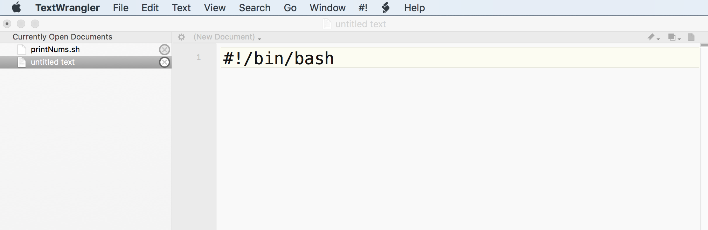
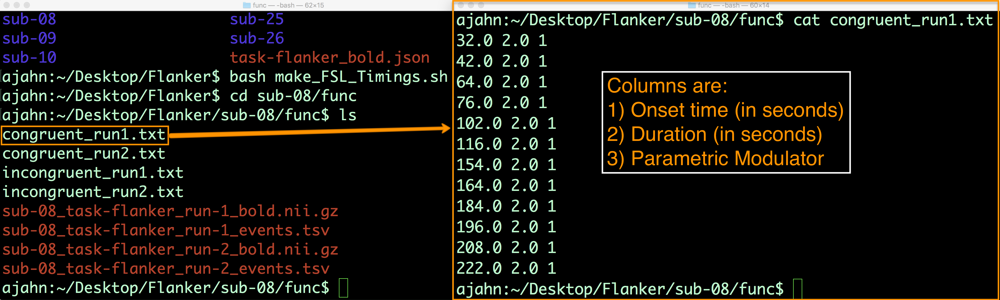

.. _Unix_07_Scripting:

第7节: 脚本编写
================

.. note::
  
  涉及主题: 通配符, 脚本编写
  
  涉及命令: awk

---------------

组合命令
***************

到目前为止，您已经学习了如何使用 for 循环和条件语句来自动化操作并决定何时运行代码块。然而，您会很快发现，每次想运行大型且复杂的代码块时，手动逐行输入会非常繁琐。此外，调试在终端中编写的长代码串也很困难。

相反，我们可以将所有内容放入一个 **脚本**中，也就是一个包含代码的文件。这使得代码更加紧凑，并且在需要时更容易在目录之间移动。此外，这也让调试变得更加简单。

下载用于编写代码的文本编辑器
****************

在开始编写脚本之前，您需要下载一个合适的代码编辑器。Windows 用户可以下载 Notepad++，而 Mac 用户可以从 Apple Store 下载 `TextWrangler <https://www.barebones.com/products/textwrangler/>`__。

编写您的第一个脚本
****************

下载 TextWrangler 后，打开它并在第一行写下这段代码，也称为 **shebang**：``#!/bin/bash``。它表示接下来的代码应使用 bash shell 解释，并遵循 bash 语法。

 示例：在 TextWrangler 中编辑的文件中的 shebang。shebang 总是写在文件的第一行，以井号和感叹号开头，后跟用于解释代码的 shell 的绝对路径。

接下来，写一个您之前见过的 for 循环，例如：

::

 for i in 1 2 3; do 
   echo $i; 
 done
 
良好的编码习惯是对 for 循环或条件语句的主体进行缩进，通常使用制表符或几个空格。这使得代码结构一目了然，便于快速找到特定命令的位置。此外，使用井号添加注释也是一个好习惯：井号后面的内容不会被 shell 解释，但对读者了解命令的作用很有帮助。例如，在循环之前，我们可以写一条注释，说明接下来的代码将打印数字 1 到 3。一些编码者喜欢在每个主要代码部分之间留一个空行；这是一种风格选择，取决于您个人的喜好。

现在点击 ``File -> Save As``，将其命名为 ``printNums.sh``，扩展名 .sh 表示该文件是一个 shell 脚本。将其保存到桌面。在终端中，导航到桌面，然后输入 ``bash printNums.sh`` 来运行它。您也可以通过输入 ``./printNums.sh`` 来运行该命令。这将运行脚本中的所有代码，就像您手动逐行输入一样。这是一个简单的例子，但您可以看到，您可以添加任意多行代码。

运行更大的脚本
***************

让我们看看如何运行包含许多代码行的更大脚本。访问 `这个链接 <https://www.github.com/andrewjahn/FSL_Scripts>`__，点击 ``make_FSL_Timings.sh``。点击 ``Raw`` 按钮查看原始文本。您可以右键单击页面上的任意位置，将其保存为脚本，或者将代码复制并粘贴到 TextWrangler 中。将其保存为 ``make_FSL_Timings.sh``，并将其移动到 Flanker 目录。

让我们看看这段代码的作用。注意，我们有一个 shebang，表明脚本是用 Bash 语法编写的；我们还在每个井号后添加了注释，标记代码的主要部分。第一段代码是一个条件语句，用于检查名为 ``subjList.txt`` 的文件是否存在；如果不存在，则列出每个受试者目录，并将该受试者列表重定向到一个名为 subjList.txt 的文件中。

通配符
^^^^^^^^^^^^^^^

这引出了一个重要的概念：**通配符**。您经常会使用两种类型的通配符。第一种是星号，它用于匹配一个或多个字符。例如，导航到 Flanker 目录并输入 ``mkdir sub-100``。如果您输入 ``ls -d sub-*``，它将返回所有以 sub- 开头的目录，无论是 sub-01 还是 sub-100。星号通配符不会区分目录名称的长度，只要它们以 ``sub-`` 开头，就会匹配并返回所有这些目录。另一种通配符是问号，它匹配任意单个字符。如果您输入 ``ls -d sub-??``，它只会返回破折号后有两个字符的目录——换句话说，它会返回 sub-01 到 sub-26，但不会返回 sub-100。

使用 Awk 进行文本处理
^^^^^^^^^^^^^^^^

for 循环的主体中包含一个新命令，称为 **awk**。Awk 是一个文本处理命令，用于打印文本文件中的列。以下是它的基本用法：如果您进入某个受试者的 func 目录并输入 ``cat sub-08_task-flanker_run-1_events.tsv``，它将返回该文件中的所有文本。对于我们的 fMRI 分析，我们需要指定开始时间和持续时间的列，以及最后一列中的数字 1 作为占位符。您可以使用竖线将此命令的输出重定向为 awk 命令的输入。然后，您可以在 awk 中使用条件语句打印特定实验条件的开始时间，并将该输出重定向到相应的文本文件中。这在下面链接的书籍章节中有更详细的讨论。

现在返回到包含所有受试者的目录，删除 sub-100 目录并运行脚本。这需要几分钟，然后会为所有受试者创建时间文件。您可以使用 cat 命令检查它们，它们应该看起来像这样：

脚本和通配符使您的代码更加灵活，并可以节省无数的劳动时间——想象一下，如果您需要为每个受试者手动输入脚本中的每条命令会有多麻烦。稍后我们将使用这些脚本来自动化整个数据集的分析——但要做到这一点，我们需要学习另一个用于处理文本的命令：sed 命令。

-------------

