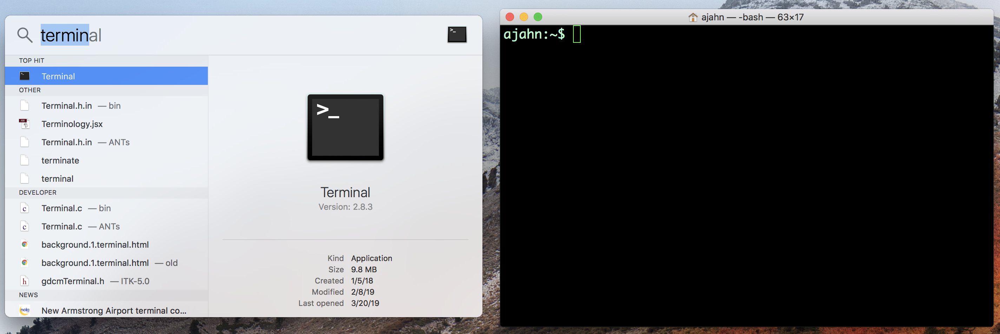

.. _Unix_Intro:

=============
Unix系统简介及其安装
=============

Unix系统简介
**********

Unix 是一种操作系统，就像 Macintosh 或 Windows 一样。Unix 与其他操作系统的主要区别在于它使用命令行界面，简称为 **命令行**：与在 Windows 或 Macintosh 机器上点击操作不同，你需要输入你想运行的命令。命令行是在 **终端** 中输入的，终端是一个只能输入文本的窗口。终端模拟（即再现）了一个 `控制台 <https://en.wikipedia.org/wiki/System_console>`__ 的功能。

    Macintosh 和 Linux 操作系统都安装了终端。例如，在 Macintosh 上，点击 Finder 放大镜，然后输入 "Terminal"。当你打开它时，你应该会看到类似右侧窗口的界面。

虽然这看起来可能很奇怪，甚至有些繁琐，但实际上使用命令行可以让你在运行程序和分析数据时更快、更灵活、更高效。你还需要了解 Unix，以便使用从命令行运行的神经影像学软件包，例如 AFNI 或 FSL。而且，正如你将看到的，熟练掌握编程将为你节省时间，减少错误，并使你作为科学家更加多才多艺。

Ubuntu22.04 LTS安装
**********
`双系统安装ubuntu 22.04 LTS(一步到位) <https://blog.csdn.net/kuwola/article/details/127618930>`__

.. note::

    Linux 操作系统（例如 Ubuntu）自带终端，最近版本的 Macintosh 操作系统也是如此。Windows 用户需要下载一个终端模拟器，例如 `Cygwin <https://www.cygwin.com/>`__。虽然我在 Macintosh 电脑上录制我的教程，但一旦你下载并安装了 Cygwin，你应该能够完成本教程。
